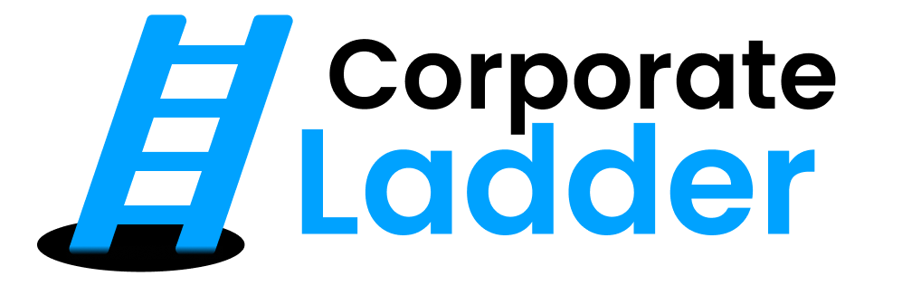
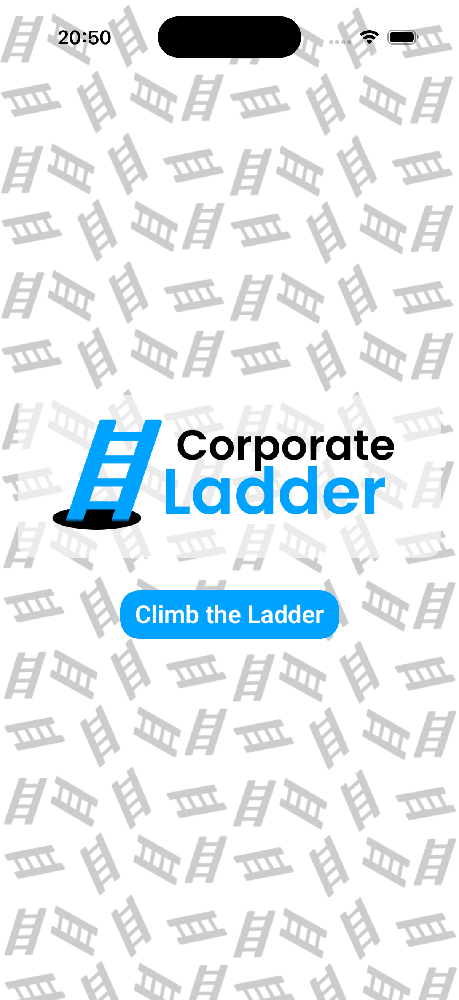
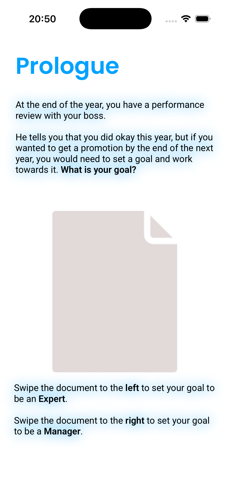
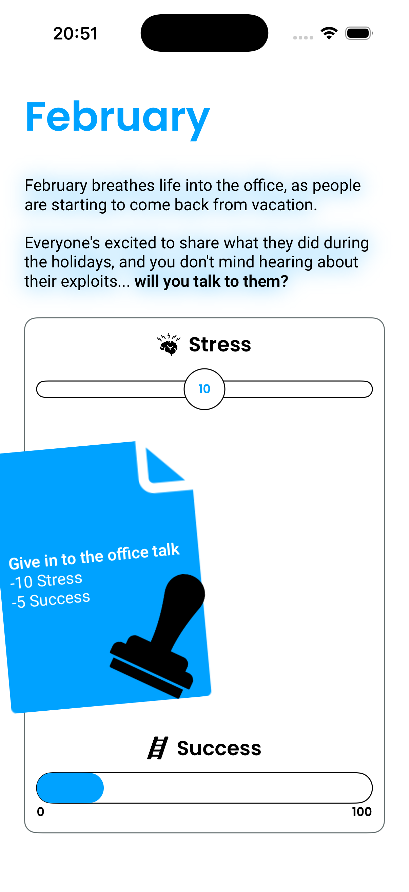
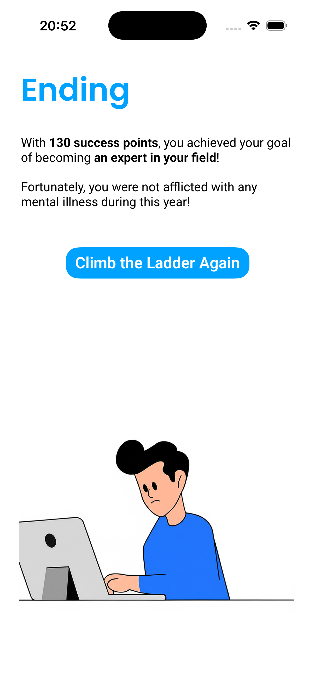

<h1 align="center">
    
</h1>

  <i align="center">A corporate simulation game where <b>every choice comes at a cost</b></i>

  
  
  
  
  

## Introduction

**Corporate Ladder** is an iPhone simulation game built with SwiftUI that puts you in the shoes of an employee navigating a full year of tough corporate decisions.

Each month presents a real workplace dilemma — pitching side projects, office gossip, mentoring coworkers, or protecting your own mental health. Your choices accumulate **stress** and **success** points, and decisions made early in the year dynamically alter the scenarios that follow, creating a branching tree of consequences.

## Screenshots

Screenshots

 

    
&nbsp;
    

    
&nbsp;
    

## Development

- **Architecture**: MVVM with `@Observable`. `GameViewModel` centralises game state, scoring logic, and runtime mutation of future decisions based on prior choices.
- **Frameworks**: SwiftUI for all UI; `AVFoundation` via `SoundManager` for stamp sound effects; `CoreHaptics` via `HapticsManager` for tactile feedback.
- The technical highlight is the **butterfly effect** system: choices made in January, April, July, and October directly modify the content and options of later months at runtime.

## Resources & Credits

- **Fonts**: [Poppins](https://fonts.google.com/specimen/Poppins) (Medium, SemiBold, Bold) and [Roboto](https://fonts.google.com/specimen/Roboto) (Regular, SemiBold, Bold) — Google Fonts.
- **Sound effects**: Stamp audio samples (`.mp3`) included in the project bundle.

## License

Corporate Ladder is available under the [MIT License](./LICENSE).
